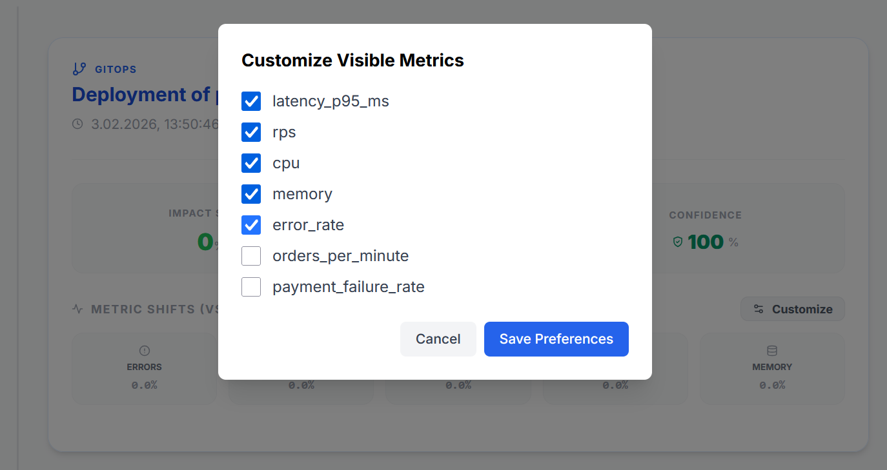
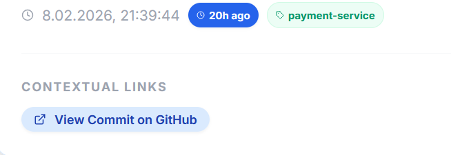
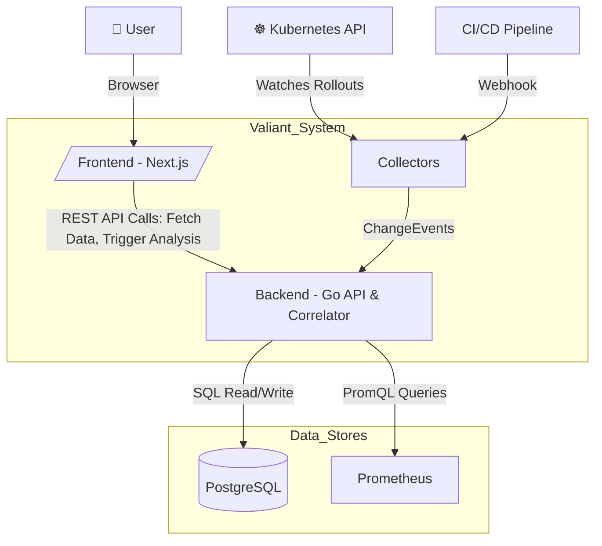

# Valiant

**Change Impact Radar for Kubernetes**

[](https://github.com/BytePeaks/valiant/actions/workflows/ci.yml)
[](https://github.com/BytePeaks/valiant/actions/workflows/release.yml)
[](https://github.com/BytePeaks/valiant/blob/main/LICENSE)
[](https://golang.org)
[](https://github.com/BytePeaks/valiant/commits)
[](https://github.com/BytePeaks/valiant)

> *"Stop wasting hours asking 'which deploy broke this?'"*

---

## The Problem

It's 3am. Latency is spiking. Five teams deployed in the last hour. Your monitoring tells you *something* is broken - error rates are up, p95 is through the roof - but it can't tell you **which change caused it**.

You open Grafana, cross-reference deploy times from ArgoCD, check the CI pipeline history, compare metrics before and after each deploy... manually. For every single change.

Existing tools tell you **what** is broken. Nobody tells you **which change** broke it.

## How Valiant Solves It

Valiant watches your cluster and automatically correlates changes with metric shifts:

- **Watches Kubernetes** - Deployment rollouts, ConfigMap/Secret changes, captured the moment they go live
- **Correlates with Prometheus** - Compares baseline metrics (before change) vs impact metrics (after change) using your existing Prometheus data
- **Scores deterministically** - No ML, no black boxes. Weighted scoring across error rate, latency, RPS, CPU, and memory. Every score is explainable.
- **Ranks concurrent changes** - When 5 deploys happened in the same hour, Valiant ranks them by likelihood of being the cause

---

## Screenshots

### Dashboard

Filter by service, namespace, and change type. Search events. See analysis status at a glance.

### Service Analytics

Impact scores, metric shifts (baseline vs impact), confidence scoring, and orphan detection for each change event.

### Custom Metrics

Define business-specific PromQL queries in `config.yaml` (e.g., orders/min, payment failures). Toggle visibility per service.

### Deep Linking
   
Instantly navigate from a change event to its origin in external systems like `Git repositories`, `CI/CD pipelines` etc.
> Configurable templates use event metadata to generate clickable links, providing immediate context and accelerating incident investigation.

---

## Key Features

- **Kubernetes native** - Watches Deployments, ConfigMaps, Secrets with annotation-based filtering
- **CI/CD webhooks** - Ingest events from any pipeline via REST API
- **Intent-execution linking** - Links CI builds to K8s rollouts via Git SHA or image tag
- **Deterministic scoring** - Weighted impact score (0-1) with NONE/LOW/MEDIUM/HIGH classification
- **Custom metrics** - Define additional PromQL queries in config, collected alongside core metrics
- **Incident investigation** - Rank concurrent changes by likelihood of causing degradation
- **Automatic analysis** - Background worker triggers analysis when impact windows close
- **Configurable retention** - Automatic event cleanup (default 90 days)
- **Immutable snapshots** - Analysis results are frozen in time, never retroactively altered
- **REST API** - Full programmatic access to events, analysis, rankings, and preferences

---

## Architecture



Go backend + Next.js frontend + PostgreSQL + Prometheus (HTTP API). See [Architecture](docs/architecture.md) for details.

---

## Prerequisites

**Local development** (Docker stack — quickest path):

| Requirement | Notes |
|:------------|:------|
| Docker + Docker Compose v2+ | Runs backend, frontend, and PostgreSQL |
| Prometheus v2+ (external) | Valiant queries your existing Prometheus — it is not bundled in the Docker stack |

**Production — Kubernetes:**

| Requirement | Notes |
|:------------|:------|
| Kubernetes 1.24+ | Valiant watches the K8s API for rollouts and config changes |
| Prometheus v2+ | Read-only — Valiant queries the HTTP API, never writes to it |

**Production — OpenShift / OKD:**

Prometheus ships with OpenShift out of the box — no separate Prometheus install required.

---

## Quick Start

```bash
git clone https://github.com/BytePeaks/valiant.git
cd valiant
docker-compose up --build -d
```

| Service | URL |
|:--------|:----|
| Dashboard | [http://localhost:3000](http://localhost:3000) |
| Backend API | [http://localhost:8080](http://localhost:8080) |
| Health Check | [http://localhost:8080/health](http://localhost:8080/health) |

Send a test event:

```bash
curl -X POST http://localhost:8080/api/v1/events \
  -H "Content-Type: application/json" \
  -d '{
    "trigger_type": "CI",
    "change_type": "build_success",
    "affected_services": ["payment-service"],
    "summary": "Build payment-service v1.0.0",
    "timestamp": "'"$(date -u +%Y-%m-%dT%H:%M:%SZ)"'",
    "metadata": {"git_commit_sha": "a1b2c3d4"}
  }'
```

See [Getting Started](docs/getting-started.md) for full setup, Kubernetes deployment, and connecting your apps.

---

## Documentation

| Document | Description |
|:---------|:------------|
| [Getting Started](docs/getting-started.md) | Installation, setup, first event, first analysis |
| [How It Works](docs/how-it-works.md) | Core concepts, scoring engine, analysis model |
| [Configuration](docs/configuration.md) | Full config reference, Prometheus queries, custom metrics |
| [API Reference](docs/api-reference.md) | All REST endpoints with examples |
| [Architecture](docs/architecture.md) | Components, data flow, design trade-offs |
| [Troubleshooting](docs/troubleshooting.md) | Common errors, performance, security |
| [Roadmap](docs/roadmap.md) | Completed features, planned work |

---

## How Valiant Compares

| | Traditional Monitoring | AIOps Platforms | Valiant |
|:--|:----------------------|:----------------|:--------|
| **Answers** | "What is broken?" | "What might be the cause?" | "Which change caused this?" |
| **Method** | Threshold alerts | ML-based correlation | Deterministic rule-based scoring |
| **Explainability** | High (simple thresholds) | Low (black box) | High (every score is traceable) |
| **Setup** | Requires alert rules | Requires training data | Watches your existing K8s + Prometheus |

---

## Roadmap

- Intent-execution linking UI ("deployment story" timeline)
- Git collector for tags and releases
- Service health pulse indicators
- RBAC manifest generation for OpenShift

See [Roadmap](docs/roadmap.md) for the full list.

---

## Contributing

We welcome contributions! Quick local setup:

```bash
# Start dependencies
docker-compose up -d db prometheus

# Backend
cd backend && go run cmd/valiant/main.go

# Frontend (separate terminal)
cd frontend && npm install && npm run dev
```

See [CONTRIBUTING.md](CONTRIBUTING.md) for code style, testing requirements, and PR guidelines. Found a bug or have a feature request? [Open an issue](https://github.com/BytePeaks/valiant/issues).

---

## License

[AGPL-3.0](LICENSE) — free to use and self-host. If you modify Valiant and deploy it as a network service, you must open-source your changes.
