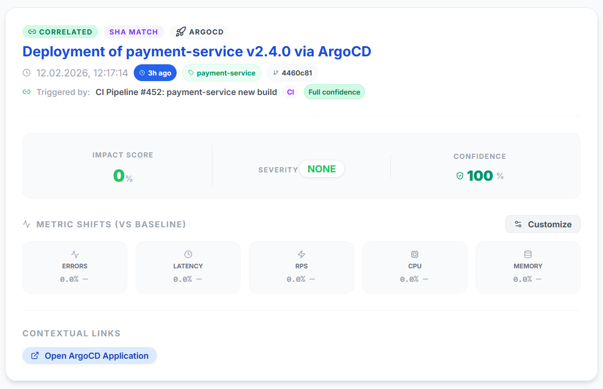
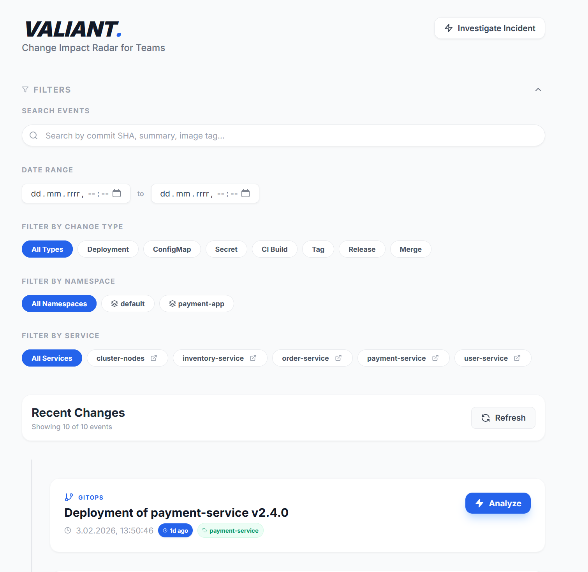

# Valiant

[](https://github.com/BytePeaks/valiant)
[](https://github.com/BytePeaks/valiant/blob/main/LICENSE)
[](https://github.com/BytePeaks/valiant)
[](https://github.com/BytePeaks/valiant/commits)

[](https://golang.org)
[](https://nodejs.org)


> A deterministic change-impact radar for correlating system changes with service degradation.

---

## Why this exists

Valiant solves a critical problem for engineering teams: quickly identifying the root cause of service degradation during an incident. It provides a clear, deterministic answer to one core question: **"Which recent change most likely caused this degradation?"**

## Core Concepts

To use Valiant effectively, it helps to understand these key principles and the analysis flow:

- A **ChangeEvent** represents when a change becomes *effective* in an environment (e.g., a deployment finishes), not when it was committed to source control.
- An **Impact Analysis** is an immutable, reproducible snapshot. An analysis performed today will yield the exact same result a year from now.
- **Correlation** is scoped to explicit, rule-based time windows (a "baseline" before the change and an "impact" window after). It is never inferred or predictive.

The basic analysis flow can be visualized as:
```
ChangeEvent → Baseline Window → Impact Window → Score
```

## Who It's Not For

- **Not a Git Activity Tracker**: Valiant focuses on *execution-boundary* changes (deploys, config updates) rather than raw Git commits or merges, which are treated as metadata of intent.
- **Not a Machine Learning System**: All correlations are based on deterministic, rule-based heuristics, not predictive or black-box ML models.
- **Not a Black Box**: Every score and correlation is designed to be fully transparent and explainable.

## Why Valiant?

Valiant fits into the observability landscape by providing a focused, deterministic link between actions and outcomes.

| Tool Type              | Answers the Question...                  | How it Works                                                               |
| :--------------------- | :--------------------------------------- | :------------------------------------------------------------------------- |
| **Traditional Monitoring** | "What is broken right now?"              | Alerts on predefined metric thresholds (e.g., CPU > 90%, latency > 200ms). |
| **AIOps Platforms**      | "What might be the cause?"               | Uses machine learning to find statistical correlations in complex systems. |
| **Valiant**            | "Which recent change caused this issue?" | Applies deterministic rules to correlate executed changes with metric shifts.    |

---

## Features

- **Change Collection**: Ingests change events from various sources, including Kubernetes (deployments, configmaps, secrets), and generic CI/CD webhooks.
- **Core Correlation Engine**: Implements a complete, deterministic impact scoring and ranking logic to link changes to service degradation.
- **Single Environment Support**: The Open Source (OSS) version is designed to target a single Kubernetes cluster and Prometheus instance.
- **Manual Analysis**: All correlation analyses are user-initiated via the UI or API, providing on-demand insights.
- **Data Storage**: Utilizes PostgreSQL for robust and reliable persistence of all change events and analysis snapshots.
- **User Interface (UI)**: Provides a full-featured timeline and incident investigation view, making it easy to visualize changes and their correlated impacts.

---

## Non-Goals

- ❌ **Real-time Processing / Proactive Incident Detection**: The OSS version performs correlation on-demand and does not continuously monitor for proactive incident detection.
- ❌ **Advanced ML-driven predictions**: Valiant's core tenet is deterministic, rule-based logic; it will not incorporate black-box, predictive ML models for its core correlation engine.
- ❌ **Distributed Event Bus (Kafka/NATS) for buffering/resilience**: For architectural simplicity in the OSS version, collectors write directly to the API, omitting complex event streaming infrastructure.
- ❌ **Multi-Environment Support (in OSS)**: The ability to connect and manage multiple clusters or environments is reserved for the Pro (paid) version.
- ❌ **Full Git History Tracking**: Valiant focuses on the *execution* of changes in an environment, not comprehensive tracking of every Git commit or merge.

---

## Architecture (High level)

Valiant is structured as a client-server application with a Go backend, a Next.js (React) frontend, and relies on PostgreSQL for persistent data storage. It integrates with Prometheus for metric data.

### Main Components
- **Backend (Go)**: Handles API requests, ingests change events via various collectors, runs the core correlation engine, and manages interactions with PostgreSQL and Prometheus.
- **Frontend (Next.js/React)**: Provides the interactive user interface for visualizing change timelines, triggering analyses, and displaying impact scores.
- **PostgreSQL**: Serves as the primary datastore for `ChangeEvent` models (audited system changes) and `ImpactAnalysisSnapshot` models (immutable results of analyses).
- **Prometheus**: An external time-series database that Valiant queries to gather metrics for impact analysis.

### How They Communicate
- **Collectors** (e.g., Kubernetes, CI/CD webhook) push `ChangeEvent` data to the **Backend API**.
- The **Frontend** communicates with the **Backend API** to fetch change events, display UI data, and initiate impact analyses.
- The **Backend** directly queries **Prometheus** using its HTTP API to retrieve metric data during the correlation process.
- The **Backend** interacts with **PostgreSQL** for all data storage and retrieval operations.

### Boundaries of Responsibility
- **Collectors**: Are responsible for observing specific external systems (Kubernetes, CI/CD) and translating relevant events into Valiant's standardized `ChangeEvent` model.
- **Backend API**: Acts as the central hub, exposing endpoints for data ingestion, data retrieval, and analysis orchestration.
- **Correlator Engine**: Encapsulates the deterministic logic for correlating change events with metric shifts and generating impact scores.
- **Frontend**: Focuses on user experience, data visualization, and allowing users to interact with the Valiant system.

## High-Level Architecture Diagram

[](https://mermaid.live/edit#pako:eNptUttu00AQ_ZXVSkUg5WK3buz4ASmxHVQVoTQJVMKpqk08OCb2brS7hoQk34B4440XPqLfww_AJzC-NEkR87CanTnHM3uOt3QuIqAujSVbLcjEn3KCcXZGenMtpCLPSLDWIDlLyXijNGSqQrxVIMM_P779LLO7qnjtqPDX94ffD1_JdT5DFmhQpDe8qvveleeH3lXb88kwWUGacMDOYeQ7liaMa-IJCXhkK8GB63qgymfVjjXqvlqnahYxCML2QAqugUekSd7AWrc-qvbdEdEPwj6bL6v-K1Eshu_DaRJShq89gXoiTaFUIDymdR_5J0v7sMIC8HkC_27qM83ux8h87BTh98PnQ6F0LGF88_rFycyhFFlYHKAXkP9_mic4x2USwU98IM3my11fis-Y71CHqjMIyvooGE_Kl3osTZVLBqDn1WoNMpFJHCO_h_ZuVKJ2KNHjMPSy5N8yxKOLI5RB5BoxR0GOrlZQmC2EWD5F1JhDpUR6C8ZjCD4V9p4O7Vc7ozBkBCxq38pEww41e9IuNELETQ4SRd-VwtEG_sJJRF0tc2jQDGTGiivdFtQpRUkzmFIX04jJ5ZRO-R45K8bfC2TXNCnyeEHdDyxVeMtXEdPgJwztzA5VWdgtPZFzTd1zo_wGdbd0TV2rc9GyTLN72bEd2zS6VoNuqGsbLevCtmzbNE3H7Fj7Bv1SzjRajn1pFOGYjm0Z3fP9Xw1xIKo)


## Data Flow

Here's a step-by-step overview of how data flows through Valiant:

1.  **Change Event Ingestion**:
    - **Kubernetes Collector**: Monitors the Kubernetes API for rollouts that carry the `valiant.io/source` annotation. Upon detecting an eligible rollout, it captures `rollout_start` and `rollout_end` times.
    - **CI/CD Webhook**: Receives generic change event payloads from CI/CD pipelines.
    - Both collectors transform these system-specific events into Valiant's canonical `ChangeEvent` model and send them to the Valiant Backend API.
2.  **Data Storage**: The Backend API receives `ChangeEvent`s and persists them in the PostgreSQL database.
3.  **Analysis Trigger**: A user navigates to a service in the Frontend UI and initiates an "Impact Analysis" request. This triggers a corresponding call to the Backend API.
4.  **Correlation Process**:
    - The Backend's Correlator Engine fetches relevant `ChangeEvent`s for the requested service and timeframe from PostgreSQL.
    - It then queries the configured Prometheus instance, retrieving metric data for a "baseline window" (before the change) and a "post-execution impact window" (after the change became available).
    - Deterministic rules are applied to compare metrics between these windows and calculate an impact score.
5.  **Immutable Snapshotting**: The results of the analysis, including the impact score and associated metrics, are stored as an immutable `ImpactAnalysisSnapshot` in PostgreSQL. This ensures historical consistency.
6.  **UI Visualization**: The Frontend retrieves the `ChangeEvent`s and `ImpactAnalysisSnapshot`s from the Backend API and renders them visually in a timeline and detailed analysis view for the user.

---

## Installation

### Requirements
- **Operating System**: Linux, macOS (Windows via WSL2 recommended)
- **Runtime**: Go (version 1.20+), Node.js (version 18+), Docker, Docker Compose
- **External Dependencies**:
    - PostgreSQL (version 12+)
    - Kubernetes cluster (for the Kubernetes collector)
    - Prometheus (version 2.x+) with metrics scraped from your services

### Local setup

The fastest way to get started is with Docker Compose.

```bash
git clone https://github.com/BytePeaks/valiant.git
cd valiant
cp example/config.yaml ./backend/config.yaml
docker-compose up --build -d
```

This script will:
1.  Clone the project repository.
2.  Navigate into the project directory.
3.  Copy the example configuration (you may need to edit it to match your environment).
4.  Build and start all services (backend, frontend, database) in the background.

To verify that everything is working, access the frontend at `http://localhost:3000` or check the backend health endpoint with `curl http://localhost:8080/healthz`.

---

## Configuration

Valiant's backend configuration is primarily managed through `backend/config.yaml`. Some settings can also be overridden by environment variables.

| Name                     | Description                                                                 | Default                      | When to Change                                                              |
| :----------------------- | :-------------------------------------------------------------------------- | :--------------------------- | :-------------------------------------------------------------------------- |
| `DB_DSN` (environment variable) | PostgreSQL connection string (e.g., `host=localhost port=5432 user=valiant password=valiant dbname=valiant sslmode=disable`) | (Must be provided)           | Always for production deployments; modify for local database setup.         |
| `PROMETHEUS_URL`         | The base URL of the Prometheus instance Valiant will query.                 | `http://localhost:9090`      | If your Prometheus instance is at a different address or port.              |
| `LISTEN_ADDRESS`         | The network address and port for the backend API server to listen on.       | `:8080`                      | If you need to change the API listening port (e.g., due to conflicts).      |
| `IMPACT_WINDOW_DURATION` | The duration for the "post-execution impact window" (e.g., `30m`, `1h`).    | `30m` (30 minutes)           | To adjust how long after a change's `rollout_end` Valiant looks for impact. |

```yaml
# backend/config.yaml
# Minimal working configuration for local development with docker-compose
server:
  listen_address: ":8080"
db:
  # Using environment variable DB_DSN is recommended, or explicitly set here.
  # For local docker-compose, this typically points to the 'db' service name.
  dsn: "host=db port=5432 user=valiant password=valiant dbname=valiant sslmode=disable"
prometheus:
  url: "http://prometheus:9090" # For local docker-compose, points to the 'prometheus' service.
correlator:
  impact_window_duration: "30m" # 30 minutes
```

---

## Usage

### Basic usage

```bash
# 1. Ensure all services are running
docker-compose up -d

# 2. Open your web browser and navigate to the frontend UI
open http://localhost:3000

# 3. In the UI, select a service for which you have ingested change events.
# 4. Trigger an "Impact Analysis" from the service's page.
# 5. Observe the timeline and analysis results displayed in the UI.
```
This shows the simplest way to get Valiant running and perform an analysis via the user interface. The expected output is a visual representation of change events and their calculated impact.

### Advanced usage

```bash
# Example: Manually submitting a CI/CD change event via the API
# This is useful for integrating Valiant with custom CI/CD pipelines.
curl -X POST -H "Content-Type: application/json" \
     http://localhost:8080/api/v1/collectors/cicd \
     -d 
     {
         "service": "my-cool-app",
         "version": "v1.2.3-build-456",
         "status": "success",
         "timestamp": "2026-01-31T15:30:00Z",
         "metadata": {
             "pipeline_name": "deployment-pipeline",
             "commit_sha": "a1b2c3d4e5f67890",
             "deployed_by": "ci-bot"
         }
     }
```
This demonstrates how external systems can directly send change events to Valiant's API, enabling integration beyond the built-in Kubernetes collector.

---

## Screenshots / UI

### Service Analytics (for now)

This screenshot highlights Valiant's core functionality: showing a detailed timeline of change events for a selected service, overlaid with the results of impact analyses, including confidence scores and metric deviations. It is important for detailed incident investigation.

### Dashboard

This screenshot depicts the overall health and recent activity across all monitored services in Valiant, allowing users to quickly identify services with recent changes or potential issues.

---

## API (if applicable)

Valiant exposes a RESTful API for ingesting change events. The primary endpoint for generic events is described below.

```
Endpoint: /api/v1/collectors/cicd
Method: POST
Description: Submits a new change event from a CI/CD pipeline or other external system.

Required Body Fields:
  - service (string): Name of the affected service.
  - version (string): Version or identifier of the change.
  - status (string): Status of the change (e.g., "success", "failure").
  - timestamp (string): ISO 8601 timestamp of the event (e.g., "2023-01-01T12:00:00Z").
  - metadata (object): Arbitrary key-value pairs for additional context.

Example Success Response:
  - Code: 202 Accepted
  - Body: (empty)

Example Error Response:
  - Code: 400 Bad Request
  - Body: { "error": "invalid change event payload: service name is required" }
```

---

## Error handling

Valiant's backend API returns standard HTTP status codes along with a JSON error object for client-side errors.

- **Client Errors (4xx)**: Indicate issues with the request (e.g., invalid payload, missing parameters). These are typically not retryable without correcting the request.
- **Server Errors (5xx)**: Indicate issues on the server-side. Some might be transient and retryable (e.g., temporary network issue), while others indicate a deeper configuration or database problem.
- **Specific Business Logic Errors**: `ErrImpactWindowNotClosed` is a special case returned when an analysis is requested before the `post_execution_impact_window` has fully elapsed. This is an intentional rejection and is retryable after the window closes.

```json
/*
  Example Error Output (Human-readable and actionable)
  HTTP/1.1 500 Internal Server Error
*/
{
  "error": "database connection failed: dial tcp 127.0.0.1:5432: connect: connection refused"
}
/*
  This error indicates a fatal problem with the PostgreSQL database connection.
  Action: Verify your DB_DSN configuration and ensure the PostgreSQL server is running and accessible.
*/
```

---

## Security considerations

- **No Built-in Authentication/Authorization**: The OSS version currently lacks user authentication and role-based access control. It is designed to be deployed within a trusted network boundary.
- **Prometheus Access**: Valiant queries Prometheus directly. Ensure that Valiant's access to Prometheus is secured and limited to the necessary query permissions to prevent unauthorized data exposure from Prometheus.
- **Logging**: While Valiant primarily logs infrastructure change events, care should be taken to ensure no sensitive user data or credentials are inadvertently logged, especially in custom metadata fields.
- **API Exposure**: If deploying Valiant's API publicly, it is critical to implement API gateway security, including rate limiting and potential authentication, in front of the Valiant backend.

---

## Performance characteristics

- **Correlation Engine Complexity**: The impact scoring logic in the correlator engine has a complexity proportional to `O(N * M)`, where `N` is the number of relevant change events in a timeframe and `M` is the number of Prometheus metric queries required per change event.
- **Network-Bound Operations**: The primary performance bottleneck often lies in network latency and throughput when querying the Prometheus HTTP API, especially for large time ranges or a high cardinality of metrics.
- **Scaling**: The OSS version is optimized for a single-cluster setup. While the Go backend is performant, high-volume, real-time ingestion across many clusters might strain the direct API-to-DB write model. The PostgreSQL database's performance will also be a factor with increasing data volume.
- **Measurements**: No specific benchmark numbers are provided currently. Performance will heavily depend on the Prometheus setup, network conditions, and the volume of change events and metrics.

---

## Limitations

- **Single-Cluster Focus**: The OSS version is designed for monitoring changes within a single Kubernetes cluster and querying a single Prometheus instance.
- **On-Demand Analysis**: Correlation is user-triggered, meaning it does not provide continuous, real-time monitoring or alerting capabilities (these are Pro features).
- **Deterministic Only**: Valiant relies on rule-based logic; it cannot infer impacts through machine learning or detect previously unknown patterns.
- **No Native Git Collector (yet)**: While planned, direct Git repository collection is not yet fully implemented in the current OSS version beyond metadata passing.
- **No Event Buffering**: Direct API writes mean that if the backend is unavailable, change events sent by collectors might be lost without an external buffering mechanism.

---

## Roadmap (optional)

### Short term:
- Implement a robust Git collector for tags and releases.
- Enhance frontend UI visualizations and interaction for a smoother investigation workflow.
- Expand testing coverage for critical backend components.

### Maybe:
- Explore additional collector integrations (e.g., Cloud provider APIs for config changes).
- Introduce more advanced (but still deterministic) correlation heuristics.
- Develop a CLI tool for easier interaction and scripting.

### Explicitly not planned:
- Multi-cluster management and visualization in the OSS version.
- Automated alerting mechanisms (reserved for the Pro version).
- Integration with complex, external event streaming platforms in the OSS version.

---

## Contributing

We welcome contributions from the community! Please refer to our [CONTRIBUTING.md](CONTRIBUTING.md) for detailed guidelines on setting up your development environment, coding style, testing, and the process for submitting pull requests. We highly value small, focused, and logical pull requests that address a single issue or feature.

---

## License

Valiant is released under the [AGPL-3.0 License](LICENSE).
This license means that if you distribute, modify, or use Valiant (or any modified version) in a networked service, you are required to also provide the source code of your version to your users. It promotes open collaboration and ensures that improvements benefit the entire community.

---

## Maintainer Notes

- **How to read this code**: The `backend/internal` directory is the heart of the Go application, logically separated by concern (`api`, `collector`, `correlator`, `domain`, `metrics`, `storage`). Begin by tracing the application flow from `backend/cmd/valiant/main.go` to understand initialization and API routing. The `backend/internal/correlator/engine.go` contains the core impact scoring logic.
- **Where are the 'mines'**: Be extremely cautious when modifying the Prometheus query logic in `backend/internal/metrics/prometheus.go`. Inefficient queries can severely impact Prometheus performance. Always test new queries rigorously. The database schema in `backend/migrations` is critical; schema changes require careful planning and migration scripts.
- **What the maintainer *least* wants in a PR**:
    - **"Big Bang" PRs**: Large, unfocused pull requests that attempt to implement multiple features or refactor extensive parts of the codebase at once.
    - **Untested Core Logic**: Any changes to `backend/internal/correlator/engine.go` or `backend/internal/metrics/prometheus.go` without corresponding, comprehensive unit and integration tests.
    - **Unjustified External Dependencies**: Adding new, complex third-party libraries without a clear and strong justification for their necessity and a discussion of their implications.
    - **Ignoring `Non-Goals`**: Pull requests attempting to implement features explicitly listed in the `Non-Goals` section without prior discussion.
